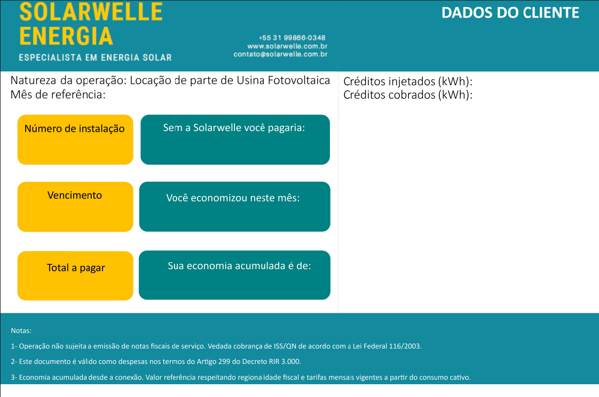
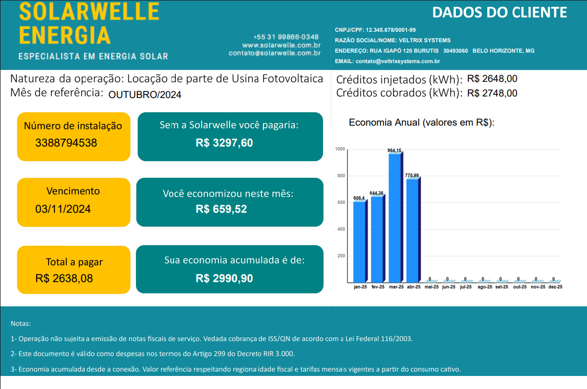

# Billing Reports Generator 🧾
> Aplicativo Desktop que automatiza a geração de relatórios mensais em PDF com base no consumo de energia de clientes de uma fazenda solar.  
> _Desktop App that automates the generation of monthly PDF reports based on the energy consumption of solar farm customers._
 

<table border="0" cellpadding="0" cellspacing="0" style="border-collapse: collapse; text-align: center;">
  <tr>
    <td style="border: none; padding: 5px;">
      <strong>PDF ORIGINAL | ORIGINAL PDF</strong>
    </td>
    <td style="border: none; padding: 5px;"></td>
    <td style="border: none; padding: 5px;">
      <strong>PDF GERADO | GENERATED PDF</strong>
    </td>
  </tr>
  <tr>
    <td style="border: none;">
      
    </td>
    <td style="font-size: 48px; padding: 0 20px; vertical-align: middle; border: none;">
      ➡️
    </td>
    <td style="border: none;">
      
    </td>
  </tr>
</table>

### 👇🏾Idioma / Language 

 pt-BR 

 
## 🎯 Objetivo  

Facilitar a geração de relatórios mensais personalizados para clientes de uma empresa de energia solar, demonstrando quanto foi economizado ao consumir energia da fazenda solar em comparação à contratação direta com a CEMIG.

## 📝 Descrição  

Aplicativo desktop desenvolvido em C# para automatizar o processo de leitura de relatórios fornecidos pela CEMIG (em formatos XML e Excel). O sistema extrai os dados de consumo mensal, identifica os clientes na base de dados através do número de instalação, calcula os valores economizados e gera arquivos PDF com todas as informações de forma clara e organizada.
 
## ⚙️ Tecnologias Utilizadas  

C# | .NET | EPPlus | iText7 | iText7.BouncyCastleAdapter

 en-US 

## 🎯 Goal  

Simplify the generation of personalized monthly reports for a solar energy company's customers, showing how much they saved by consuming energy from the solar farm instead of contracting directly with CEMIG.
 
## 📝 Description  

Desktop application built in C# to automate the reading of energy usage reports provided by CEMIG (XML and Excel formats). It extracts monthly consumption data, matches customers in the database using installation numbers, calculates savings, and generates organized PDF reports with all relevant details.

## ⚙️ Tools Used  

C# | .NET | EPPlus | iText7 | iText7.BouncyCastleAdapter

 

## 📞 Contato / Contact 

